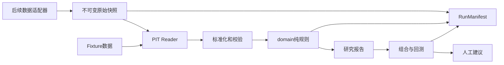

# 量化研究系统架构

## 范围

本项目的目标是形成可复现的 A 股量化研究与人工下单建议系统。当前实施阶段只提供：

- 冻结规则的纯计算；
- 合成 fixture 与 PIT（point-in-time）读取验证；
- 可复现的运行元数据；
- 绝对估值、穿透回报和基础决策聚合。

当前阶段允许将真实数据采集到不可变原始快照，并由 v1.2.0 的阶段 A
Foundation Reader 做证券、日历、RAW 行情、累积因子和中债利率的点时读取验收。
v1.3.0 进一步放行企业前提、行情位置、证券池、排序、组合与回测的纯逻辑和合成
fixture。v1.3.1 将 H00985 基准 Reader 在两份已验收快照各自覆盖内转为 ready。
财务、分红、回购、行业、历史股本、证券状态、交易能力、公司行为和历史费率
仍未就绪，因此仍不发布真实选股或回测业绩，也不提交真实订单。

## 不可违反的边界

1. `domain/` 是纯领域层，不导入 `adapters/`，不进行网络、文件或数据库 I/O。
2. 历史读取只能经过 `pit/`；回测时只可见 `available_at <= as_of` 的记录。
3. `UNKNOWN` 不等于 `0`，`NOT_APPLICABLE` 不等于失败，普通缺字段不使用异常作为业务分支。
4. 规则、公式和单位的唯一实现依据是版本化的 `RULE_SPEC.md`。
5. 阶段 A Reader 只授权点时读取与数据质量验收；v1.3.0 的 ready 只授权纯逻辑
   和合成 fixture，v1.3.1 另授权已验收 H00985 快照的基准读取。在全部生产域
   及跨域 manifest ready 前，不得将输出称为真实
   选股、可发布回测或交易建议。

## 分层

### `turtle_quant/core/`

- `types.py`：金额、比例、日期、证券和时间语义的受限类型。
- `result.py`：规则状态、规则性质、证据和缺失字段。
- `pit.py`：fixture PIT Reader，负责可见性和修订版本选择。
- `market_data.py`：阶段 A 行情、覆盖问题、累积因子和利率的不可变值对象。
- `manifest.py`：可重现运行清单。
- `protocols.py`：未来数据适配器需要遵守的只读接口。

### `turtle_quant/valuation/`

- `absolute.py`：六年现金回本、Coverage、Payback 与 SupportPrice。
- `lookthrough.py`：共享容量分配、GG 和价阶。

### `turtle_quant/pipeline/`

- `decision.py`：按规则状态、估值证据与评分覆盖率输出领域决策。

### v1.3.0 纯逻辑层

- `evidence/validate.py`：已知零、未知和非法差额的证据状态校验。
- `premise/`：通用 FCF 科目桥接、连续年度、六项硬门与四项质量评分。
- `market/position.py`：756/504 行情位置、证据覆盖、mid-rank 与回撤。
- `strategy/`：点时证券池、诊断输出边界、横截面排序、目标权重与订单计划。
- `backtest/`：严格成交、历史成本、T+1、公司行为、组合记账、绩效、逻辑内容
  哈希和 `StrategyRunManifest`。

这些包不导入生产 adapter，也不自行选择快照；生产 Reader 的输出必须先经过对应
域的独立验收，才能作为输入。

### 原始数据基础设施

- `adapters/`：仅实现数据源认证、拉取和原始到规范 schema 的映射。
- `adapters/financial_statement_samples.py`：阶段 B1.1 的固定样本纯映射与向前观察修订链；没有网络抓取，不接入同步或研究 Reader。
- `adapters/dividend_samples.py`：阶段 B2 的固定分红样本纯映射；交叉核验法定公告、AKShare 与 Baostock，后续报告构成不可回填的支付状态修订。旧 v1 样本无普通性证据时保持 UNKNOWN；仅附有固定年度方案/实施公告双 PDF 侧证的 v2 样本可依已批准规则标记这一笔普通性为 TRUE，窗口 `D` 仍 UNKNOWN。
- `adapters/buyback_samples.py`：阶段 B3 的固定回购样本纯映射；将累计进度转为区间增量，不虚构区间内的实际执行日。
- `storage/`：以 staging → 内容寻址快照的方式保存不可变原始数据和元数据。
- `scripts/sync_local_data.py`：只编排同步、恢复和质量门槛，不调用领域规则。

原始基础设施的字段、PIT、事件三态、质量和发布契约见
`docs/data-ingestion-contract.md`。

### PIT 与生产门槛

- `pit/parquet_foundation.py`：唯一获准实现的真实阶段 A 入口；显式绑定各域快照，
  fail-closed 校验后提供证券、日历、RAW 行情、累积因子和中债利率读取。
- `pit/parquet_financial_statements.py`、`parquet_dividends.py`、
  `parquet_buybacks.py`：各自独立的未就绪财务/事件入口。
- `pit/parquet_finance.py`：三个专用财务域全部 ready 后才能开放的聚合门面。
- `pit/parquet_benchmark.py`：显式绑定 H00985 快照，复核官方原始响应、独立日历、
  规范行与例外证据；返回抓取时点、显式排除日期和结构化证据。2005–2026
  全区间快照已发布并验收；v1.3.1 仅在已验收快照覆盖内将本 Reader 转为 ready。
- `pit/parquet.py`：旧范围含混接口的兼容 stub，始终显式失败并引导调用方选择
  foundation 或专用财务 Reader。
- 财报、分红、回购、行业、历史股本、证券状态、交易能力、公司行为和成本
  的生产数据门槛仍按 `RULE_SPEC` 保持 `not_ready`；基准 Reader ready 不会
  自动解除其他门槛或放行真实回测。

## 时间、复权与历史可见性

财务、行业、证券状态和公司行为都必须有可用时间。PIT 的选择算法为：

1. 过滤 `available_at <= as_of` 的记录；
2. 在相同经济期间内，按 `(available_at, provider_revision_sequence)` 选择最后可见版本；
3. 仅当供应商明确保证单调性时才使用 `revision_id` 排序。

研究价格使用 `ADJUSTED_TO_AS_OF`：先固定 `available_at <= as_of` 的累积因子
观察，历史日取截至该日的最新累积因子水平并除以估值日水平。估值日价格保持
可交易原始收盘价；模拟成交使用原始价格与单独的公司行为事件。

分红和回购领域聚合使用显式三态。窗口内相关事件的日期、金额、普通性、
支付/执行或注销状态只要仍未知，聚合结果就是 `UNKNOWN`；明确排除的事件和
窗口外事件不会污染结果。样本适配器提供的证据尚未接入生产 PIT Reader。

## 行业边界

上市状态、市值和流动性可作为通用证券池条件。行业 Profile 必须在 PE/PB、毛利率、负债率、FCF 等行业敏感规则前选定。

v1 只自动处理通用 FCF 模型适用的非金融、非开发商标的。银行、保险和开发商在对应专用规则、fixture 与 `ready_when` 完备前返回 `NOT_SUPPORTED` 或 `NEEDS_REVIEW`，不得套用通用 FCF 路径。

## 可复现性

每次计算都应产生 `RunManifest`，至少包含：

- `manifest_version`、`run_id`、`as_of`、`code_version`、`rules_version`；
- `config_hash`、`universe_hash`、`snapshot_ids`、`source_versions`；
- 利率来源、fallback 策略和数据质量标记。

相同 fixture、规则版本、代码版本和 `as_of` 必须产生相同输出。
`RunManifest` 必须支持确定性 JSON 序列化和内容哈希，以便比较相同运行身份。
`snapshot_ids` 与 `data_quality_flags` 按无序集合规范化；快照 ID 重复是输入错误，质量标记重复会合并为一项。

策略运行另建 `StrategyRunManifest` 并引用基础 manifest 哈希。订单、持仓和净值按
冻结主键转换为 canonical row stream 后比较逻辑内容 SHA-256；Parquet 编码器产生
的物理元数据和字节差异不构成不确定性。
