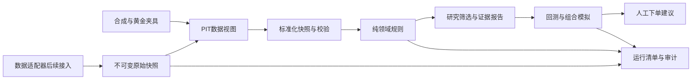

# 量化系统架构修订计划

> 状态：已冻结的实施计划；初始 core/valuation/fixture 实现已完成，当前不接入真实数据源。
>
> 规则语义、变更记录与实现依据以 [RULE_SPEC.md](RULE_SPEC.md) 为准。本文件归档架构决策与实施顺序。

## 审核结论

现有规则草案可保留领域规则纯函数、阈值配置化、显式结果状态和 `IndustryProfile` 四个优点，但不能直接作为可信真实数据研究或回测系统实施。

终局目标为“可复现回测 + 人工下单研究建议”；当前阶段只实现数据源无关的契约、规则与测试夹具，不能声称已有真实回测结论。

## 开工前必须修正的 P0 问题

- 冻结估值公式，禁止“缺公式则 TODO 但不阻塞交付”。
  - `P` 是估值日该经济权益的可交易收盘价；`MV=P×S`，且同日、同币种、同一股份权益。
  - `GG` 与 `II` 均使用百分数值，`5` 表示 `5%`；`max(10, II)` 中 `10` 是十个百分点，不是 bp。
  - 共享容量：
    ```text
    D_alloc = min(max(D, 0), max(O, 0))
    B_alloc = min(max(B_buyback, 0), max(0, O - D_alloc))
    ShareholderCash_net = D_alloc × (1 - tau) + B_alloc
    GG = ShareholderCash_net / MV × 100
    ```
  - `D` 为 `(valuation_date−365 自然日, valuation_date]` 内、当时已知且实际支付的普通现金股息。
  - `B_buyback` 为 365 日含端点窗口的合格已执行回购，取：
    ```text
    min(B_actual_365d, B_latest_complete_calendar_year)
    ```
    并满足持续性与注销核验条件。`B_latest_complete_calendar_year` 是截至估值日事件覆盖已核验完整的最近结束自然年；若覆盖不可核验，主路径 `B_buyback=UNKNOWN`，不得回退到更早年度或把未知写成 0。
  - 可独立输出 `executed_buyback_365d=B_actual_365d` 作为未经年度覆盖限制的历史执行参考；它不得命名为 lower bound、代入 GG 或作为主路径 fallback。
  - 价阶：
    ```text
    ObservePrice = P × GG / II
    HeavyPrice = P × GG / max(10, II)
    StandardPrice = (ObservePrice + HeavyPrice) / 2
    ```
    仅在 `P`、`GG`、`II` 均为正时计算。
- 所有 Reader 必须是点时读取：输入有 `as_of`，财务记录有 `period_end`、`announcement_time`、`available_at`、`revision_id`。
  - PIT 先过滤 `available_at <= signal_time`，再按有序的 `(available_at, provider_revision_sequence)` 取最后版本。
  - 仅当供应商保证单调顺序时，`revision_id` 才能作为排序键。
- fixture PIT Reader 至少验证：
  - 未来可用记录被过滤；
  - 同一期间三版本只返回信号日前最新可用版本；
  - 信号日前修订覆盖较早版本；
  - 历史退市证券仍在当时证券池。
- 行情契约必须包含历史价格、复权因子、公司行为、交易日历、停复牌和含退市的证券主表。
  - `market/position.py` 与 `valuation/floor_price.py` 共同使用 `ADJUSTED_TO_AS_OF`（前复权到估值日尺度）价格序列。
  - 交易执行使用原始成交价并独立应用公司行为。
- 在任何行业敏感筛选前完成 `IndustryProfile` 分发。
  - 上市状态、市值、流动性是通用证券池过滤。
  - PE/PB、毛利率、负债率、FCF 等只在对应 Profile 路径中执行。
  - v1 仅自动筛选通用 FCF 模型适用的非金融、非开发商标的；银行、保险、开发商输出 `NOT_SUPPORTED` 或 `NEEDS_REVIEW`。
- 用统一的单位体系。
  - 使用 `Decimal`、受限类型、单位元数据和显式校验器。
  - 类型包括 `NonNegativePct`、`SignedPct`、`UnitRatio`、`BasisPoints`、`NonNegativeDays`、`Money`。
  - 外部数据字段为空时只能表示 `UNKNOWN`，没有隐式零值或其他默认值；方法参数如 `tau=0` 必须由版本化配置显式提供。

## 目标架构



- `adapters/`：未来的数据源实现，只负责认证、拉取、缓存和映射；领域层不可依赖它。
- `storage/`：不可变原始快照及版本元数据；后续可选 Parquet/DuckDB 用于研究数据，SQLite 用于轻量元数据和本地测试。
- `pit/`：唯一历史读取入口；当前由 fixture/local-snapshot 实现，后续适配器不得绕过它。
- `domain/`：`derived`、`accounting`、`premise`、`valuation`、`scoring`、`decision`；保持无 I/O。
- `decision.py` 属于 `domain/`，只判定基本面/估值条件和状态，不含持仓、调仓或订单。
- `application/`：研究筛选、历史回测、人工建议。
- `ops/`：输出：
  ```text
  RunManifest(
    manifest_version, run_id, as_of, code_version, rules_version,
    config_hash, universe_hash, snapshot_ids, source_versions,
    treasury_yield_source_used, fallback_policy, data_quality_flags
  )
  ```

## RULE_SPEC.md 的强制章节

### 变更管理

- 使用语义化版本：`vMAJOR.MINOR.PATCH`。
- 每条记录包含版本、日期、提出者、批准者、变更内容、精确差异、理由、受影响模块、配置/代码/测试同步项与状态。
- 流程：提出变更 → 项目负责人批准规则语义 → 更新 `RULE_SPEC.md` 并升级 `rules_version` → 同步代码、配置、fixture 与测试 → 记录迁移/兼容性结论。
- 禁止静默改写、绕过记录直接改代码或配置、以及用新规则解释旧运行结果。

### 变量表

每个字段必须记录：

- 会计科目或业务含义；
- 规范单位类型；
- 是否允许负值、大于 100% 或为空；
- 时间口径；
- 公告/可用日期；
- 适用行业 Profile；
- 原始证据；
- 指向 reference 或 fixture 的证据链。

### 自建算例

每个自建算例必须有：

- 算例编号与标题；
- 完整输入字段；
- 逐步公式和中间结果；
- 最终测试断言；
- 来源说明（reference 路径或“自建”）。

复权因子与 D/B 窗口边界 fixture 不得只记录最终数字。

### ready_when

`ready_when` 是唯一实施推进门槛，按计划代码文件/模块逐行维护，例如 `valuation/lookthrough.py`。

每行必须记录：

- 文件路径；
- 公式、输入科目、单位、时间口径、fixture、预期输出的就绪条件；
- 状态：`ready` 或 `not_ready`；
- 阻塞项；
- 状态变更的日期、操作者和对应 RULE_SPEC 版本。

只有 `ready` 模块允许实现。未就绪模块只能声明接口并显式 `NotImplementedError`；测试必须证明它们不会产生猜测性结果或默认结论。若单个文件含多个可独立就绪的规则，应先拆分模块。

## 实施顺序

1. 保留 `stellar-aurora-einstein-DqHPR5P3.md` 原文作为规则草案和决策历史。
2. 创建 `ARCHITECTURE.md`、`RULE_SPEC.md` 和 README 术语边界。
3. 冻结 D/E 公式、D/B 窗口、价阶、Coverage、TTM/quarterize、前复权和未知值语义；以本地 skill 的算例及自建推导建立黄金测试。
4. 逐模块维护 `ready_when`；仅实现满足 `ready` 条件的模块。
5. 在 `turtle_quant/core/` 定义带单位和时间语义的实体、`AsOfContext`、`RunManifest`、证据引用和 Result 状态。
6. 设计 `MarketDataReader`、`FinancialDataReader`、`CorporateActionsReader`、`SecurityMasterReader`、`RateCurveReader`，当前仅实现 fixture/local-snapshot。
7. 实现通用股票路径：行业分发、财务标准化、TTM/quarterize、FCF、Coverage、GG、前提门控和证据链。
8. 定义 `strategy/` 与 `backtest/` 契约：证券池、信号截点、Top-N、权重、调仓、卖出、成交价、成本、T+1、涨跌停、停牌、退市和基准。
9. 未来选定并验证 A 股数据源后，实现适配器、快照落盘、字段对账和点时测试，再运行全历史回测。

## 决策与评分规则

- 优先级：
  ```text
  输入/数据质量不足 → NEEDS_REVIEW
  行业不适用 → NOT_SUPPORTED
  硬门失败 → 淘汰
  绝对估值与 GG 条件 → 候选资格
  评分 → 候选排序
  组合规则 → 是否产生建议
  ```
- 常规缺字段返回带 `missing_fields` 与证据的 `UNKNOWN`；顶层决策降级为 `NEEDS_REVIEW`。
- `MissingDataError` 仅用于适配器/契约损坏等无法正常计算的错误。
- `FALLBACK` 利率默认继续但降级为 `NEEDS_REVIEW`，记录来源和日期；仅当 `block_on_fallback=true` 时阻断。
- `RuleResult.rule_kind`：
  ```text
  HARD_GATE | SCORE | EVIDENCE | INFORMATION
  ```
- 聚合规则：
  - 任一 `HARD_GATE=FAIL`：淘汰；
  - 任一 `HARD_GATE=UNKNOWN`：`NEEDS_REVIEW`；
  - `SCORE=UNKNOWN`：保留未评分并记录覆盖率，不记 0 分；
  - `EVIDENCE/INFORMATION=UNKNOWN`：仅标注。
- `IndustryProfile` 显式声明 `applicable_score_rule_ids`：
  ```text
  score_coverage =
    已得出分数的适用 SCORE 权重 / Profile 全部适用 SCORE 权重
  ```
  Profile 不适用的规则不计入分母；适用但未知的规则仍计入分母。专业 Profile 所需规则未就绪时，Profile 为 `NOT_SUPPORTED` 或 `NEEDS_REVIEW`，不得缩小分母伪造完整覆盖率。
- `score_coverage<1` 时仅输出 `NEEDS_REVIEW`、`reference_raw_score`、`reference_score_max` 和覆盖率；不进入 Tier1/2/3，也不参与排序。
- 配置去重：
  - `[tier]` 预筛段改名 `[screening]`；
  - 仅保留 `[market].tau`，删除 `q_tax`；
  - Coverage 阈值仅在 `[valuation.payback]`；
  - 通用 `roe_min` 由 `[premise.quality]` 定义，行业 Profile 覆盖值优先。

## 验收标准

- `RULE_SPEC.md` 变量表完整、可追溯、无猜测字段。
- GG、Coverage、Observe/Heavy/Standard、D/B 窗口及复权演算例通过黄金测试；自建算例保留完整推导。
- PIT fixture 验证未来数据过滤、历史修订选择、三版本选择和退市证券池。
- `floor_price` 与 `market_position` 对同一 `as_of` 使用相同版本的 `ADJUSTED_TO_AS_OF` 因子序列，并断言其 hash 相同。
- 可空外部字段只能得到 `UNKNOWN`，不能由类型层填充 `0`。
- `score_coverage<1` 的 fixture 只输出 `NEEDS_REVIEW` 和不完整参考分，不可进入 Tier 或排序。
- 未启用的专业 Profile 为 `NOT_SUPPORTED`，不得靠排除规则生成完整评分。
- 相同夹具、配置、代码版本和 `as_of` 重跑，必须获得相同结果和完整 `RunManifest`。
- 只有明确组合与成交规则后才称为回测策略；只有真实历史数据接入后才发布绩效指标。
